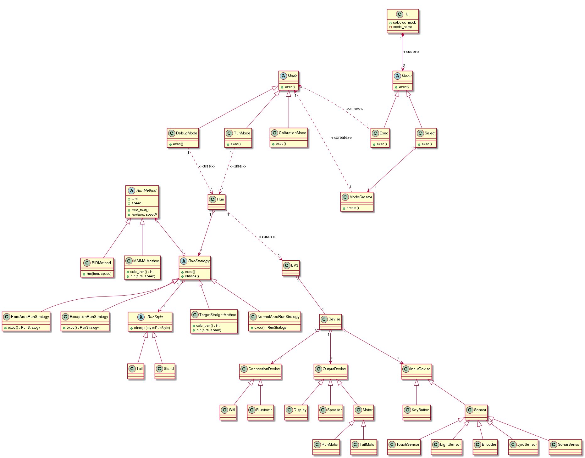

# discription

### 概念クラス図

# boundly

- ファクトリーメソッドパターンを採用
- 選択されたメニューに適切なインスタンスを返してくれるModeCreterを用意
- Selectクラスで選択したモードをModecreterに渡すことで実現
- ExecクラスがModeCreaterが作成したインスタンスを使う

# controller

- ModeはRunMode, DebugMode, CalibrationMode である
- RunModeは, Runを使う
- RunはRunStrategyを持っていて，ev3を使って走行する
- RunStrategyはRunMethodとRunStyleを持っている
- RunMethodは走法である．まいまい走法やPID走法，決め打ち直線走法を指す
- RunStyleは走行体の状態である．しっぽ走行状態や，二輪倒立振子状態がある

# Entitiy

- 実際の構成に忠実に
- 必要に応じて抽象化

