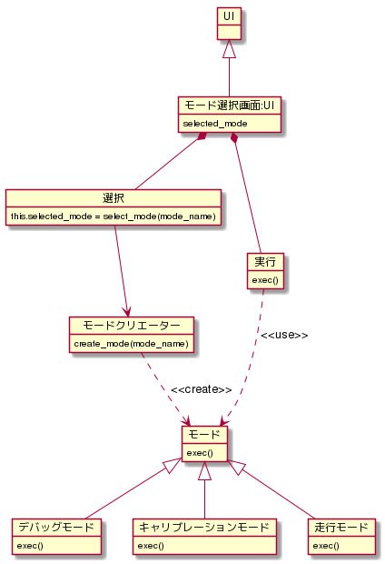

- モード選択画面は選択と実行から構成される(a part of)


# 備考

ファクトリーメソッドパターンとステートパターンの組み合わせイメージ
()-> の()はメソッドってわかりやすくするために

ModeSelector
```coffee
class ModeSelector
  this.selected_mode

  constructor: ()->
    # has a, a part of な部分
    this.select = new Select()
    this.exec   = new Exec()
end
```

Select
```coffee
class Select

  constructor: ()->
    # 略

  select_mode: ()->
    # モード入力, ここデバイスとのつながりが未定のため仮
    mode_name = get_string()
    # modeのインスタンスを返す   モードクリエータにインスタンスの生成を委譲
    return this.selected_mode = ModeCreater.create_mode(mode_name)

end
```

Exec
``` coffee
class Exec

  constructor: ()->
    # 略

  exec: (mode)->
    mode.exec()
end
```


``` coffee
# javaやc++ ではstatic クラスになるね
class ModeCreater
  # クラスメソッド
  this.create_mode: (mode_name)->
    # インスタンス作って返すよ
    return new Mode(mode_name)
end
```
