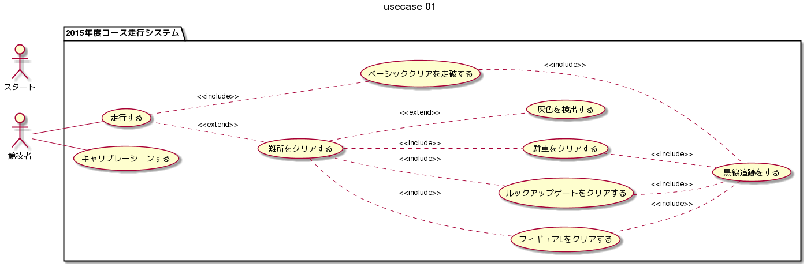

# ユースケース図

## ユースケースシナリオ

|   |   |
|---|---|
|ユースケース名|キャリブレーションする|
|アクター|EV3|
|事前条件|キャリブレーションの準備が整っている|
|トリガー|タッチセンサが押下される|

## 主成分シナリオ

1. ユーザからタッチセンサ入力を受け付ける。
2. システムは光センサを用いて、光を読み取る。
3. システムは読み取った光を処理し、閾値を算出する。
4. システムはEV3に閾値を返す。

## ユースケースシナリオ

|   |   |
|---|---|
|ユースケース名|走行する|
|アクター|競技者|
|事前条件|走行体が倒立している|
|トリガー|タッチセンサが押下される(bluetoothかも)|

## 主成分シナリオ

1. ユーザからタッチセンサ入力を受け付ける。
2. 走行体は黒線に沿って走行する。
3. 難所に差し掛かった場合は、難所をクリアする。

## ユースケースシナリオ

|   |   |
|---|---|
|ユースケース名|難所をクリアする|
|アクター|競技者|
|事前条件｜走行体が倒立している|
|トリガー|難所への侵入が検知される|

## 主成分シナリオ

1. 難所への親友が検知される(段差検知か、距離での判断か)。
2. 難所をクリアする動作をする。

## ユースケースシナリオ

|   |   |
|---|---|
|ユースケース名|黒線追跡する|
|アクター|競技者|
|事前条件|走行体が倒立している|
|トリガー|   |

## 主成分シナリオ

1. 光センサで地面の光を読み取る。
2. 黒ならhoge側に曲がり、白ならhogehoge側に曲がる。
3. 1-2を繰り返す。
